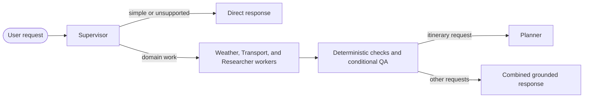

<p align="center">
  <a href="https://github.com/Silvestre17/LISBOA_MultiAgentSystem">
    
  </a>
</p>

# 🗺️ LISBOA (Lisbon Itinerary System Based On AI): A Multi-Agent Approach for Personalized Tourism and Urban Mobility in Lisbon 🤖

<p align="center">
  <strong>Grounded Multi-Agent Assistance for Lisbon Tourism and Urban Mobility</strong>
</p>

<p align="center">
  <a href="https://github.com/Silvestre17/LISBOA_MultiAgentSystem"></a>
  <a href="https://andresilvestre17-lisboa.hf.space/"></a>
  <a href="./LICENSE"></a>
</p>

<p align="center">
  <a href="./pyproject.toml"></a>
  <a href="./docs/02_SYSTEM_ARCHITECTURE.md"></a>
  <a href="./tools/__init__.py"></a>
  <a href="#research-context"></a>
</p>

<a id="overview"></a>
## 📍 Overview

**LISBOA** (*Lisbon Itinerary System Based On AI*) is the software artifact of an MSc thesis at NOVA Information Management School (NOVA IMS). It provides grounded, context-aware assistance for tourism and urban mobility in Lisbon and the Lisbon Metropolitan Area (*Área Metropolitana de Lisboa*, AML).

The system combines specialized LLM agents with on-demand weather and transport integrations, municipal open data, tourism datasets, multilingual retrieval-augmented generation (RAG), and a constrained web fallback. A bilingual Streamlit interface, in European Portuguese and English, serves both tourists planning a visit and residents looking for mobility or local-service information.

> [!IMPORTANT]
> LISBOA is a Lisbon-focused research prototype. It is not a booking, ticketing, reservation, navigation, or emergency service.

<a id="quick-links"></a>
## 🔗 Quick Links

| System | Run, Research, and Reference |
|---|---|
| [📍 Overview](#overview) | [🚀 Quick Start](#quick-start) |
| [👥 Who LISBOA Serves](#who-lisboa-serves) | [🧪 Validation and Evaluation](#validation-and-evaluation) |
| [🎓 Research Context](#research-context) | [🗂️ Repository Structure](#repository-structure) |
| [📊 Current System Snapshot](#current-system-snapshot) | [📚 Documentation](#documentation) |
| [✨ Core Capabilities](#core-capabilities) | [⚙️ Automation](#automation) |
| [🏗️ System Architecture](#system-architecture) | [⚠️ Limitations and Responsible Use](#limitations-and-responsible-use) |
| [🌐 Data and Grounding](#data-and-grounding) | [📖 Citation](#citation) |
| [🧰 Technology Stack](#technology-stack) | [📄 License](#license) |

<a id="who-lisboa-serves"></a>
## 👥 Who LISBOA Serves

| Audience | Typical Needs | Main Data Sources |
|---|---|---|
| **🧳 Tourists** | Itineraries, attractions, museums, events, weather-aware plans, and transport between landmarks | VisitLisboa, the Lisboa Card guide, IPMA, Metro de Lisboa, Carris Urban, CP, and multimodal routing |
| **🏠 Residents** | Daily mobility, nearby public services, local events, and municipal information | Lisboa Aberta, IPMA, Metro de Lisboa, Carris Urban, Carris Metropolitana, and CP |
| **🧪 Researchers and developers** | Reproducible architecture, grounded-tool design, and evaluation workflows | Source code, technical documentation, evaluation corpus, validators, and results |

<a id="research-context"></a>
## 🎓 Research Context

- **Thesis:** *LISBOA: A Multi-Agent Approach for Personalized Tourism and Urban Mobility in Lisbon*
- **Acronym:** *Lisbon Itinerary System Based On AI*
- **Author:** André Filipe Gomes Silvestre
- **Supervisors:** Prof. Dr. Bruno Jardim & Prof. Dr. Miguel de Castro Neto
- **Degree:** Master's in Data Science and Advanced Analytics, specialization in Data Science
- **Institution:** NOVA Information Management School (NOVA IMS), Universidade NOVA de Lisboa
- **Academic year:** 2025/2026

<a id="current-system-snapshot"></a>
## 📊 Current System Snapshot

| Item | Current Implementation |
|---|---|
| User-facing entry point | `app.py`, a bilingual Streamlit interface |
| Runtime | `MultiAgentAssistant` orchestration in [`agent/graph.py`](./agent/graph.py) |
| Agent roles | 6: Supervisor, Weather, Transport, Researcher, Quality Assurance, and Planner |
| Exported tools | 45, registered in [`tools/__init__.py`](./tools/__init__.py) |
| Vector collections | 3: `lisbon_pdf`, `lisbon_places`, and `lisbon_events` |
| Evaluation corpus | 72 scenarios across 6 domains |
| Automation | 4 GitHub Actions workflows: data refresh, vector sync, transport assets, and deployment |

Counts refer to the current `main` branch. The thesis evaluation used the code at commit [`9235dd3`](https://github.com/Silvestre17/LISBOA_MultiAgentSystem/tree/9235dd3) (May 15, 2026).

<a id="core-capabilities"></a>
## ✨ Core Capabilities

- 🌦️ **Weather:** IPMA forecasts, daily summaries, and warnings.
- 🚇 **Urban mobility:** Metro de Lisboa, Carris Urban, Carris Metropolitana, CP suburban rail, and supported multimodal connections.
- 📍 **Places and services:** VisitLisboa attractions, accommodation, restaurants, and events, plus Lisboa Aberta municipal services.
- 📚 **Grounded knowledge:** Multilingual semantic retrieval over the VisitLisboa collections and the Lisboa Card guide.
- 🧭 **Itinerary synthesis:** Plans built from the evidence gathered by the workers and the constraints stated in the request.
- 💬 **Conversation:** Relevant follow-up context in European Portuguese or English, with current-turn constraints taking priority.
- ✅ **Validation:** Deterministic checks and formatting guardrails, with generative QA and targeted retries when required.

<a id="system-architecture"></a>
## 🏗️ System Architecture

<p align="center">
  
</p>

[`MultiAgentAssistant`](./agent/graph.py) orchestrates six complementary roles:



| Agent | Responsibility |
|---|---|
| **Supervisor** | Classifies intent, resolves conversational context, and routes the request |
| **Weather** | Retrieves IPMA forecasts and warnings |
| **Transport** | Queries the supported Lisbon and AML transport operators |
| **Researcher** | Retrieves tourism, event, municipal-service, RAG, and constrained web evidence |
| **Quality Assurance** | Checks completeness, grounding, language, and response quality when generative QA is required |
| **Planner** | Synthesizes multi-stop itineraries from the evidence gathered by the workers |

Workers and tool calls can run concurrently when a request spans several domains and the selected provider supports it; LM Studio batches run sequentially to avoid overloading a local model server. The detailed control flow is in [System Architecture](./docs/02_SYSTEM_ARCHITECTURE.md).

<a id="data-and-grounding"></a>
## 🌐 Data and Grounding

<p align="center">
  <strong>Integrated Data Sources</strong>
</p>

<p align="center">
  <a href="https://www.visitlisboa.com/"></a>
  <a href="https://lisboaaberta.cm-lisboa.pt/index.php/pt/"></a>
  <a href="https://api.ipma.pt/"></a>
  <a href="https://www.metrolisboa.pt/"></a>
  <a href="https://www.carrismetropolitana.pt/"></a>
  <a href="https://www.carris.pt/"></a>
  <a href="https://www.cp.pt/"></a>
  <a href="https://comboios.live/"></a>
</p>

| Layer | Main Sources | Tools | Use |
|---|---|---:|---|
| Weather | IPMA | 4 | Forecasts, daily summaries, and warnings |
| Public transport | Metro de Lisboa, Carris Urban, Carris Metropolitana, and CP/Comboios.live | 30 | Status, arrivals, schedules, stops, routes, and multimodal connections |
| Tourism | VisitLisboa places and events, and the Lisboa Card guide | 5 | Attractions, accommodation, restaurants, events, and tourism knowledge |
| Municipal services | Lisboa Aberta | 5 | Geospatial lookup of public services and urban datasets |
| Web fallback | Wikipedia, Tavily, and DuckDuckGo | 1 | Lisbon history, culture, and very current context not covered by local sources |
| **Total** | | **45** | |

Semantic retrieval (ChromaDB with multilingual `BAAI/bge-m3` embeddings) serves the VisitLisboa and Lisboa Card collections. The other layers are queried directly through structured APIs, GTFS/GTFS-RT feeds, and GeoJSON datasets. Availability and freshness depend on each upstream provider and on the repository's refresh workflows.

The detailed inventory and its boundaries are in the [Tools Reference](./docs/03_TOOLS_REFERENCE.md) and in [Data Sources and Schemas](./docs/04_DATA_SOURCES_AND_SCHEMAS.md).

<a id="technology-stack"></a>
## 🧰 Technology Stack

<p align="center">
  
  
  
  
  
  
  <a href="./Dockerfile"></a>
</p>

| Component | Implementation |
|---|---|
| LLM providers | Azure OpenAI, OpenAI, and LM Studio |
| Agent framework | LangChain components, LangGraph worker graphs, and custom `MultiAgentAssistant` orchestration |
| Retrieval | ChromaDB with multilingual `BAAI/bge-m3` embeddings |
| Interface | Bilingual Streamlit application |
| Data processing | Python, pandas, HTTP clients, GTFS/GTFS-RT, GeoJSON, and SQLite |
| Evaluation | pytest checks, benchmark and ablation runners, dual LLM-as-a-Judge scoring, and statistical analysis |
| Deployment | Docker image deployed to Hugging Face Spaces through GitHub Actions |

<a id="quick-start"></a>
## 🚀 Quick Start

> [!NOTE]
> A hosted instance runs on Hugging Face Spaces, but access may be restricted. To try LISBOA, run it locally or with Docker.

### Requirements

- Python **3.10 to 3.13**, as declared in [`pyproject.toml`](./pyproject.toml)
- Git
- One configured LLM provider: Azure OpenAI, OpenAI, or LM Studio
- Internet access for provider calls and the first model and data downloads

Metro de Lisboa credentials, a Tavily key, a Hugging Face token, and LangSmith tracing are optional; each enables its own integration.

### Local Installation

```bash
git clone https://github.com/Silvestre17/LISBOA_MultiAgentSystem.git
cd LISBOA_MultiAgentSystem

python -m venv .venv

# Windows PowerShell
.\.venv\Scripts\Activate.ps1

# macOS/Linux
source .venv/bin/activate

python -m pip install --upgrade pip
python -m pip install -r requirements.txt
```

Copy the environment template and fill in only the services you intend to use:

```powershell
# Windows PowerShell
Copy-Item .env.example .env
```

```bash
# macOS/Linux
cp .env.example .env
```

The committed default provider is Azure OpenAI. To use OpenAI or LM Studio instead, change `Config.MODEL_PROVIDER` in [`config.py`](./config.py) and set the matching variables in `.env`. Provider selection and credential inputs are disabled in the production interface.

Build or incrementally synchronize the vector store, then start the app:

```bash
python tools/vector_store.py
streamlit run app.py
```

The first run takes longer while the embedding model and transport data are prepared. Provider, vector-store, TLS, tracing, and troubleshooting details are in [Deployment and Operations](./docs/05_DEPLOYMENT_AND_OPERATIONS.md).

### Docker

```bash
docker build -t lisboa .
docker run --env-file .env -p 8501:8501 lisboa
```

Open `http://localhost:8501` once Streamlit reports that it is ready.

<a id="validation-and-evaluation"></a>
## 🧪 Validation and Evaluation

Install the full research dependency set first, or use the Conda environment described in [Deployment and Operations](./docs/05_DEPLOYMENT_AND_OPERATIONS.md):

```bash
python -m pip install -r requirements_all.txt
```

```bash
# Syntax and deterministic integrity checks
python scripts/syntax_check.py
python -m pytest eval/tests/ -q

# End-to-end smoke suite (requires a configured LLM provider)
python scripts/run_prompts.py --suite smoke

# Research evaluation runners (module invocation is required)
python -m eval.run_benchmark --mode run_test
python -m eval.run_ablation --mode run_test
```

> [!TIP]
> On Windows consoles, add `-X utf8` (for example, `python -X utf8 scripts/run_prompts.py --suite smoke`) if emoji or accented characters fail to print.

The evaluation separates deterministic checks, isolated worker benchmarking, a paired zero-shot ablation, LLM-as-a-Judge scoring, prompt smoke tests, statistical analysis, and a formative user study. Outputs are written to `eval/results/`; the methodology and output schemas are documented in the [Evaluation README](./eval/README.md).

<a id="repository-structure"></a>
## 🗂️ Repository Structure

```text
agent/              Multi-agent orchestration, prompts, planning, QA, and formatting
tools/              Weather, transport, tourism, open-data, location, and RAG tools
data_collection/    VisitLisboa scrapers and source documents
data/               Local transport assets, pricing metadata, and vector-store data
eval/               Evaluation corpus, benchmark and ablation runners, validators, and analyses
scripts/            Smoke tests, provider checks, data publishing, and hosted startup
docs/               Architecture, tools, data, deployment, and operations documentation
img/                Banner, logos, and the framework figure
.github/workflows/  Data refresh, vector sync, transport assets, and deployment
app.py              Streamlit entry point
config.py           Provider, model, path, and runtime configuration
Dockerfile          Container image for local and hosted deployment
```

<a id="documentation"></a>
## 📚 Documentation

| Document | Purpose |
|---|---|
| [Documentation Index](./docs/00_INDEX.md) | Entry point to the repository documentation |
| [Project Overview](./docs/01_PROJECT_OVERVIEW.md) | Scope, audiences, and research context |
| [System Architecture](./docs/02_SYSTEM_ARCHITECTURE.md) | Agent roles, orchestration, and runtime design |
| [Tools Reference](./docs/03_TOOLS_REFERENCE.md) | Tool inventory, agent ownership, and coverage boundaries |
| [Data Sources and Schemas](./docs/04_DATA_SOURCES_AND_SCHEMAS.md) | Providers, freshness, schemas, and vector collections |
| [Deployment and Operations](./docs/05_DEPLOYMENT_AND_OPERATIONS.md) | Setup, configuration, deployment, automation, and troubleshooting |
| [Evaluation README](./eval/README.md) | Evaluation design, commands, outputs, and interpretation boundaries |

<a id="automation"></a>
## ⚙️ Automation

| Workflow | Trigger | Purpose |
|---|---|---|
| [`data_pipeline.yml`](./.github/workflows/data_pipeline.yml) | Daily at 04:00 UTC (places on Mondays) and manual runs | Refreshes the VisitLisboa events and places |
| [`sync_vector_db.yml`](./.github/workflows/sync_vector_db.yml) | After a successful data refresh and manual runs | Synchronizes the ChromaDB collections incrementally and publishes them as a GitHub Release asset |
| [`sync_transport_runtime_data.yml`](./.github/workflows/sync_transport_runtime_data.yml) | Daily at 03:25 UTC, relevant pushes to `main`, and manual runs | Publishes the Carris Urban and CP runtime assets |
| [`deploy_huggingface_space.yml`](./.github/workflows/deploy_huggingface_space.yml) | Relevant pushes to `main`, completed vector or transport syncs, and manual runs | Deploys the Streamlit app to Hugging Face Spaces |

<a id="limitations-and-responsible-use"></a>
## ⚠️ Limitations and Responsible Use

- Coverage is limited to Lisbon, the AML, and the providers implemented in this repository.
- Live data may be unavailable, delayed, cached, scraped, or release-backed, depending on the source.
- The planner synthesizes the evidence gathered by the workers; it is not an independent factual check.
- The repository publishes the automated evaluation artifacts; the user-study data are not included.
- Confirm departures, disruptions, opening hours, prices, tickets, accessibility, and reservations with the official provider before acting.
- Do not enter credentials, sensitive personal data, private identifiers, or confidential information into prompts or logs.

<a id="citation"></a>
## 📖 Citation

Until the thesis or an article with a persistent identifier is available, cite the software as:

> Silvestre, A., Jardim, B., & Neto, M. de C. (2026). *LISBOA: A multi-agent approach for personalized tourism and urban mobility in Lisbon* (Version 1.0.0) [Computer software]. GitHub. https://github.com/Silvestre17/LISBOA_MultiAgentSystem

```bibtex
@software{silvestre_jardim_castro_neto_2026_lisboa,
  author    = {Silvestre, André and Jardim, Bruno and Neto, Miguel de Castro},
  title     = {{LISBOA}: A Multi-Agent Approach for Personalized Tourism and Urban Mobility in Lisbon},
  year      = {2026},
  version   = {1.0.0},
  type      = {Computer software},
  publisher = {GitHub},
  url       = {https://github.com/Silvestre17/LISBOA_MultiAgentSystem}
}
```

Once the thesis or an article with a persistent identifier is published, cite that record for research claims and this repository for the software implementation.

<a id="license"></a>
## 📄 License

Released under the [MIT License](./LICENSE).

---

<p align="center">
  <a href="https://www.novaims.unl.pt/"></a>
</p>

<p align="center">
  <i>Master's in Data Science and Advanced Analytics, specialization in Data Science (2025/2026)</i>
</p>
