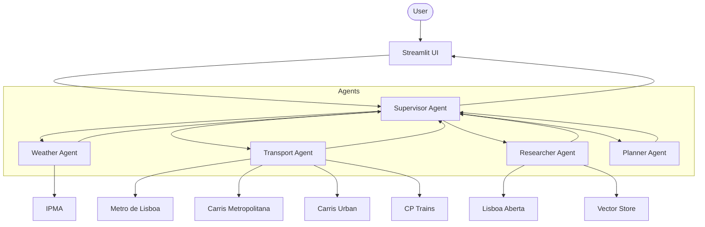

# Architecture

This document describes the repository architecture and how the multi-agent system is wired.

## High-level view

- UI entrypoint: `app_v1.py` (Streamlit)
- Multi-agent graph: `agent/graph.py`
- State schema: `agent/state.py`
- Tools layer: `tools/` and the exports in `tools/__init__.py`

Key config:

- Global settings: `config.py`
- LLM instantiation: `agent/llm_factory.py`

## Multi-agent system (LangGraph)

Roles:

- Supervisor: routes tasks to workers and synthesizes final responses.
- Weather agent: IPMA tools.
- Transport agent: Metro, bus, train tools.
- Researcher agent: semantic search, open data lookup.
- Planner agent: itinerary synthesis.

Mermaid overview:

Notes:

- The tool count is **42** (see `tools/__init__.py`).
- Carris Urban provides 7 tools for city buses and historic trams (28E, 15E, etc.)
- The vector store is an internal component used by semantic search, not a LangChain tool export.

## LLM providers and model selection

The project uses a factory pattern (`agent/llm_factory.py`) to create LLM clients.

Providers:

- LM Studio: local OpenAI-compatible server (`Config.LMSTUDIO_BASE_URL`)
- OpenAI: API key via `OPENAI_API_KEY`
- Azure OpenAI: v1-style endpoint (`AZURE_OPENAI_ENDPOINT` with `/openai/v1/` appended)

Multi-agent per-role models:

- Each agent uses `LLMFactory.get_agent_llm(agent_name)`.
- The per-agent provider and model are configured in `config.py` under `AGENT_MODELS_AZURE`, `AGENT_MODELS_OPENAI`, and `AGENT_MODELS_LMSTUDIO`.

## Tool binding by agent

Each agent receives a curated tool set in `agent/agents/base.py` via `get_agent_tools(agent_name)`.

Examples:

- Weather agent: IPMA tools only
- Transport agent: Metro, Carris (urban and metropolitana), CP, and multimodal routing
- Researcher agent: VisitLisboa semantic search, Lisboa Aberta open data, and web knowledge

## Tracing (optional)

If LangSmith is installed and enabled, multi-agent execution can emit traces.

- Tracing support is detected dynamically (graceful fallback when not installed).
- Enable via environment variables documented in `docs/OPERATIONS.md`.

## State and prompts

- Typed state is defined in `agent/state.py`.
- Prompt templates are stored under `agent/prompts/`.

### AgentState Schema (Detailed)

The `AgentState` TypedDict defines the complete state managed by LangGraph during agent execution.

**Core Fields:**
- **`messages`**: `List[BaseMessage]` with `add_messages` reducer
  - Conversation history (SystemMessage, HumanMessage, AIMessage, ToolMessage)
  - Automatically appends new messages without duplication
  
- **`session_id`**: `str`  
  - Unique identifier for this conversation session
  
**User Context:**
- **`user_context`**: `Optional[UserContext]`
  - `latitude`, `longitude`: GPS coordinates
  - `preferences`: List of interests (e.g., ["museums", "food"])
  - `language`: Language code ("en" or "pt")
  - `available_time`: Available hours for activities
  - `mobility`: Accessibility level ("full", "limited", "wheelchair")

**Cached Data:**
- **`weather_context`**: `Optional[WeatherContext]`
  - IPMA forecast data (temperatures, precipitation, warnings)
  - Cached to avoid redundant API calls
  
- **`transport_context`**: `Optional[TransportContext]`
  - Metro/bus/train status snapshot
  - Updated when transport tools are called

**Multi-Agent Orchestration:**
- **`agents_to_call`**: `Optional[List[str]]`
  - Queue of agent names from supervisor routing
  - Example: `["weather", "researcher", "planner"]`
  
- **`agent_outputs`**: `Optional[Dict[str, str]]`
  - Collected outputs from specialized agents
  - Keys: agent names, Values: their responses
  
- **`iteration_count`**: `Optional[int]`
  - Loop prevention counter (max 10 iterations)

**Planning State:**
- **`current_plan`**: `Optional[List[dict]]`
  - Active itinerary items being built
  
- **`candidate_pois`**: `Optional[List[dict]]`
  - RAG search results for places/attractions
  
- **`events_data`**: `Optional[List[dict]]`
  - RAG search results for cultural events

**Implementation:**
- Location: `agent/state.py`
- Helper: `create_initial_state(session_id=None)` returns empty state
- Updaters: `update_weather_context()`, `update_user_location()`

## Data flow

1. Scrape VisitLisboa to JSON (events daily, places weekly).
2. Sync the vector database incrementally when JSON changes.
3. Agents query tools and (when relevant) semantic search.

## Performance

Optional optimization utilities exist under `agent/utils/optimization.py`:

- HTTP session pooling (requests reuse)
- TTL caches for expensive API calls
- Parallel tool execution helpers
