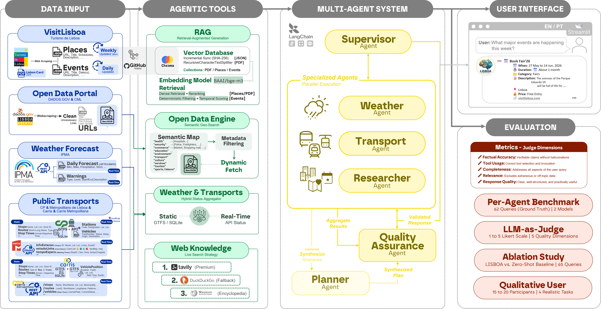
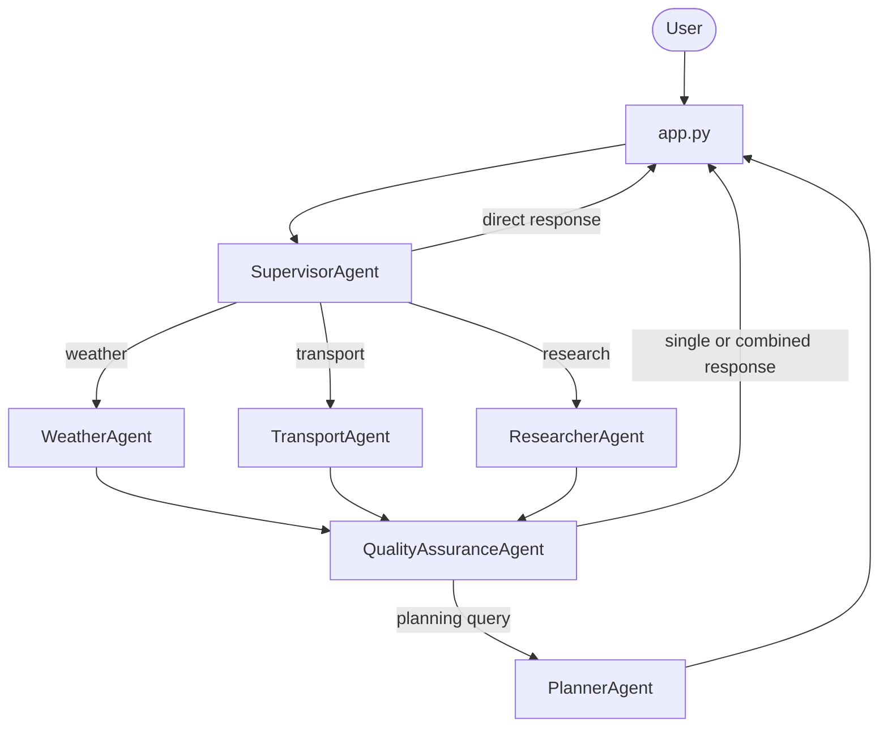

# 🏗️ LISBOA System Architecture

This document describes the runtime architecture implemented in the repository today. The supported default path is the multi-agent flow inside `MultiAgentAssistant` in `agent/graph.py`.

> [!IMPORTANT]
> The repository still contains the single-agent `LisbonAssistant` for compatibility, but the documented default runtime is the multi-agent system.

## 🖼️ Conceptual Framework Figure

  

## 🧩 High-Level Components

| Layer | Main files | Responsibility |
|------|------------|----------------|
| UI | `app.py` | Streamlit chat, provider/model selection, session state, quick actions, info pages, startup warmup of Carris Urban DB, Metro station cache, CP GTFS + AML support, Carris Metropolitana caches, and (in multi-agent mode) the vector store |
| Orchestration | `agent/graph.py` | supervisor routing, parallel worker execution, QA pass, planner synthesis or direct response |
| State | `agent/state.py` | shared `AgentState` and user-context schema |
| LLM provider factory | `agent/llm_factory.py` | provider creation and per-agent binding (Azure OpenAI, OpenAI, LM Studio) |
| Specialized agents | `agent/agents/` | domain routing, retrieval, validation, synthesis |
| Tool & data layer | `tools/` | live APIs, ChromaDB semantic search, Lisboa Aberta on-demand discovery, web fallback |

## 🔁 End-to-End Runtime Flow

### What this means in practice

1. The user sends a request through `app.py`.
2. `SupervisorAgent.route()` decides whether the answer can be returned directly or whether worker agents are needed.
3. Weather, transport, and research workers can run in parallel.
4. `QualityAssuranceAgent.validate()` checks completeness, disclaimers, and retry needs.
5. If the route includes planning and QA confirms the grounded worker evidence is sufficiently complete, `PlannerAgent.synthesize()` writes the final itinerary.
6. If QA still marks the grounded evidence as incomplete after the retry path, planner publication is skipped and the runtime falls back to structured worker outputs plus explicit caveats.
7. Otherwise, the system returns a direct or combined response without invoking the planner.

## 🤝 Agent Roles and Tool Assignments

| Agent | Primary role | Assigned tools | Notes |
|------|--------------|---------------:|------|
| `SupervisorAgent` | query routing and direct handling | 0 | returns direct responses for greetings and out-of-scope cases |
| `WeatherAgent` | weather retrieval | 4 | IPMA only |
| `TransportAgent` | transport retrieval | 30 | Metro, Carris Metropolitana, Carris Urban, CP, and multimodal tools |
| `ResearcherAgent` | tourism, services, and knowledge retrieval | 11 | VisitLisboa, Lisboa Aberta, and web fallback |
| `QualityAssuranceAgent` | validation and retry guidance | 0 | validates outputs, adds disclaimers, and can trigger one retry path |
| `PlannerAgent` | final planning synthesis | 0 | only used when the route explicitly includes the planner |

## 🎯 Final Response Semantics

One of the most important architectural details is that the planner is **not** always the final responder.

- **Planning queries:** the final answer is synthesized by `PlannerAgent.synthesize()`.
- **Greetings or out-of-scope requests:** the response can be returned directly by the supervisor.
- **Simple single-domain requests:** the response can come from one specialist worker or from combined worker outputs, without using the planner.
- **Language resolution in the 2026-04 runtime:** final user-facing answers are emitted only in **PT-PT** or **English**. If the detected input language is neither Portuguese nor English, the runtime answers in English and prepends a small bilingual note explaining that the assistant is optimized for PT-PT and English.

This behavior is implemented in `MultiAgentAssistant.chat()` in `agent/graph.py`.

## ✅ QA in the Real Runtime

`QualityAssuranceAgent` is not a general conversational front-end. Its runtime role is to:

- inspect worker outputs
- detect missing critical data
- attach disclaimers about data limitations
- guide a single retry path when worker outputs are incomplete
- perform deterministic validation for certain factual checks

The QA step happens **after** worker execution and **before** final synthesis or response combination.

## 🛠️ Tool Mapping by Worker

| Worker | Composition |
|--------|-------------|
| `WeatherAgent` | IPMA, 4 tools |
| `TransportAgent` | Metro 6 + Carris Metropolitana 8 + Carris Urban 8 + CP 6 + multimodal 2 |
| `ResearcherAgent` | VisitLisboa 5 + Lisboa Aberta 5 + web knowledge 1 |

## 🧠 State Management

`agent/state.py` defines `AgentState`, which carries:

| State field | Purpose |
|-------------|---------|
| `messages` | conversation history |
| `user_context` | effective output language, UI language, detected input language, bilingual-note flag, location, mobility, preferences, available time |
| `weather_context` | cached weather context when available |
| `transport_context` | cached transport context when available |
| `current_plan` | current itinerary structure |
| `candidate_pois` | retrieved places under consideration |
| `events_data` | retrieved event records for planning |
| `agents_to_call` | supervisor routing decision |
| `agent_outputs` | collected worker outputs |
| `iteration_count` | loop-prevention and execution-tracking metadata |

## ⚙️ Provider and Model Selection

`agent/llm_factory.py` supports **LM Studio**, **OpenAI**, and **Azure OpenAI**. Per-agent model selection lives in `config.py` (`AGENT_MODELS_LMSTUDIO`, `AGENT_MODELS_OPENAI`, `AGENT_MODELS_AZURE`); the Streamlit sidebar can override provider and per-agent choices at runtime.

## 🛡️ Reliability and Control Mechanisms

- loop detection for repeated tool calls and forced response generation
- safe LLM invocation with Azure content-filter retry handling
- parallel worker execution with context propagation
- single QA-guided retry path; deterministic validation in QA stage
- response cleanup and formatting before Streamlit rendering
- per-agent usage and latency tracking hooks
