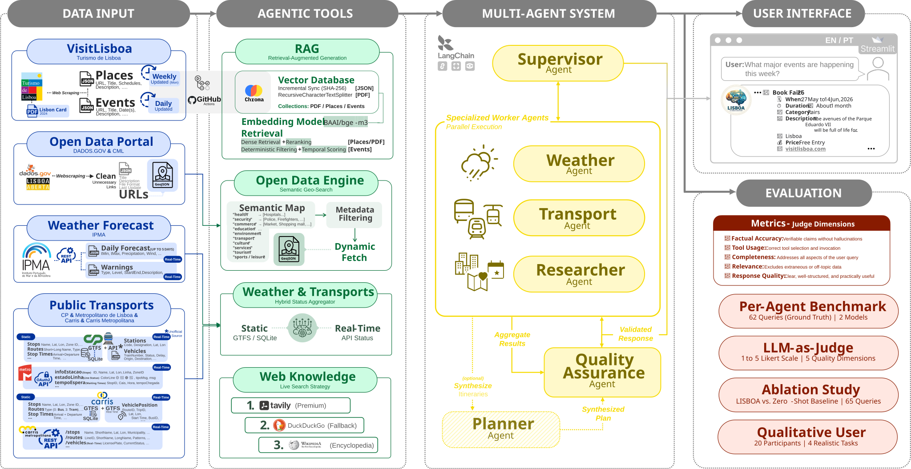
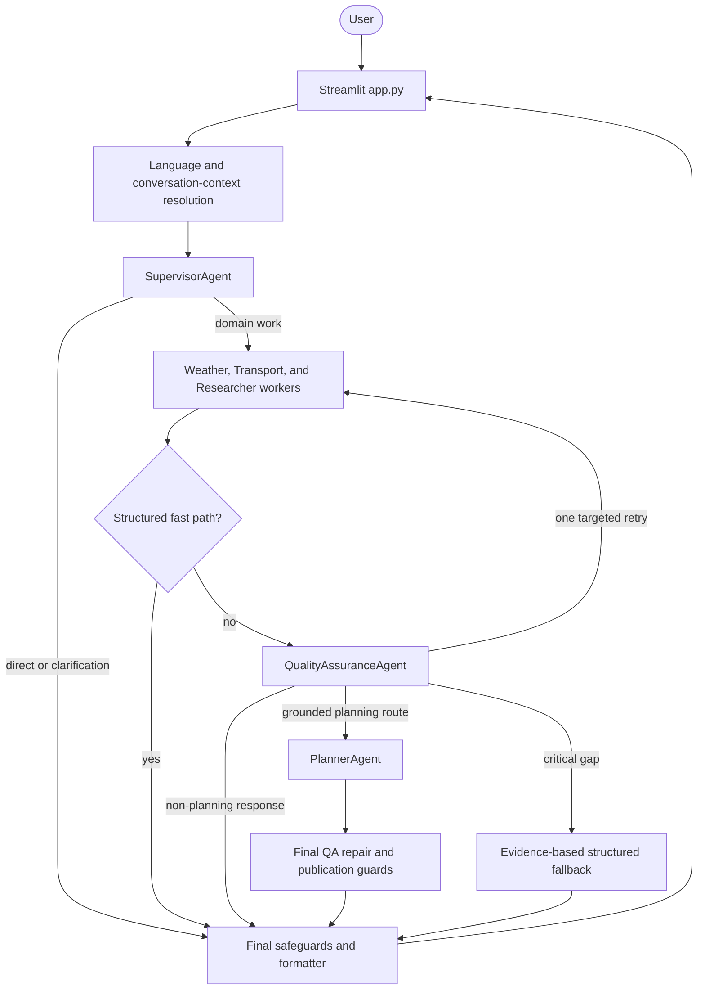

# 🏗️ LISBOA System Architecture

The supported runtime is `MultiAgentAssistant` in `agent/graph.py`, exposed through the Streamlit application in `app.py`.

## 🖼️ Conceptual Framework

  

> [!NOTE]
> The figure shows the research framework. The control flow below documents the current code, including the conditional QA bypasses and the publication safeguards.

## 🧩 Runtime Layers

| Layer | Main Files | Responsibility |
|---|---|---|
| Interface and startup | `app.py`, `agent/utils/startup_resources.py` | Chat, session state, language and interface settings, credential checks, and shared resource readiness |
| Orchestration | `agent/graph.py` | Context resolution, routing, worker execution, validation, retries, planning, and finalization |
| Agent roles | `agent/agents/` | Domain retrieval, QA, and itinerary synthesis |
| State | `agent/state.py` | Conversation and context schema used by the orchestrator |
| Providers | `agent/llm_factory.py`, `config.py` | Azure OpenAI, OpenAI, and LM Studio clients and per-agent model mappings |
| Tools and data | `tools/` | APIs, GTFS/GTFS-RT, geospatial resolution, local and release data, ChromaDB, and the web fallback |
| Output safeguards | `agent/agents/qa_agent.py`, `agent/utils/response_formatter.py` | Conditional generative repair, deterministic checks, source footers, and Markdown cleanup |

## 🔁 End-to-End Flow

```mermaid
flowchart TD
  User([User]) --> UI[Streamlit app.py]
  UI --> Context[Language and conversation-context resolution]
  Context --> Supervisor[SupervisorAgent]

  Supervisor -->|direct or clarification| Final[Final safeguards and formatter]
  Supervisor -->|domain work| Workers[Weather, Transport, and Researcher workers]

  Workers --> Gates{Structured fast path?}
  Gates -->|yes| Final
  Gates -->|no| QA[QualityAssuranceAgent]
  QA -->|one targeted retry| Workers
  QA -->|non-planning response| Final
  QA -->|grounded planning route| Planner[PlannerAgent]
  QA -->|critical gap| Fallback[Evidence-based structured fallback]

  Planner --> Publication[Final QA repair and publication guards]
  Publication --> Final
  Fallback --> Final
  Final --> UI
```

Step by step:

1. The graph resolves the answer language, the current-turn constraints, and genuine follow-ups before routing.
2. `SupervisorAgent` answers simple or direct cases itself, or selects the Weather, Transport, and Researcher workers and, when needed, the Planner.
3. Several workers run concurrently only when more than one is selected and none uses a local provider; LM Studio batches run sequentially.
4. Source-backed structured outputs (weather, transport, municipal services, accessibility, checklists, and route-plus-place answers) can bypass generative QA after deterministic checks.
5. Other worker outputs go through generative QA. Missing or repairable evidence can trigger one targeted worker retry, followed by one revalidation.
6. Planning requests normally use `PlannerAgent.synthesize()` when the evidence is suitable. The Supervisor first reads the request into a plan brief (start point, areas, time window, requested stop types and counts, mode, constraints) that steers the Researcher's searches and the Transport route request. The Planner drafts the itinerary from the evidence, one review pass sends detected issues back to the model once, and the final plan is composed and rendered deterministically (`agent/planning/`). Critical QA findings, narrow requests that do not need a plan, or synthesis failures produce bounded, evidence-based outputs instead.
7. Optional final QA repair, planner publication guards, response cleanup, and a single source footer run before rendering.

## 🤝 Agent Roles and Tool Ownership

| Agent | Role | Exported Tools |
|---|---|---:|
| `SupervisorAgent` | Routing, direct cases, and clarification decisions | 0 |
| `WeatherAgent` | IPMA forecast and warning retrieval | 4 |
| `TransportAgent` | Metro de Lisboa, Carris Metropolitana, Carris Urban, CP, and multimodal retrieval | 30 |
| `ResearcherAgent` | VisitLisboa, Lisboa Aberta, Lisboa Card, and constrained web retrieval | 11 |
| `QualityAssuranceAgent` | Conditional validation, retry guidance, and final repair | 0 |
| `PlannerAgent` | Itinerary synthesis from gathered evidence | 0 |

The graph also uses internal support functions for context handling, location resolution, evidence enrichment, and deterministic repair. They are not part of the 45-tool registry.

## ✅ Validation and Response Semantics

- **Direct cases:** Greetings, capability questions, safe out-of-scope replies, clarifications, and some contextual follow-ups can finish without workers.
- **Structured specialist cases:** Deterministic checks in the graph and the formatter keep grounded output without an unnecessary generative rewrite.
- **QA cases:** Generative QA checks completeness and critical factual risks, and can request one targeted retry.
- **Planning cases:** Planner synthesis is preferred when the route and the evidence justify it; a narrow specialist answer or a structured fallback is used when it is safer.
- **Final repair:** Only responses with repairable QA findings enter the post-draft repair path; the deterministic publication guards have the final say.
- **Language:** Final answers are in PT-PT or English. Requests in other languages receive an English answer with a short language note.

## 🧠 State and Conversation Context

`agent/state.py` declares a broad `AgentState` schema. In the current `MultiAgentAssistant` path, the fields actively persisted are:

| Active Field | Current Use |
|---|---|
| `messages` | User and assistant conversation history |
| `user_context` | Effective, interface, and detected language, the bilingual-note flag, and conversation anchors |
| `session_id` | Session identity |
| `agent_outputs` | Orchestration container; each turn also uses local output structures |

The schema also declares `weather_context`, `transport_context`, `current_plan`, `candidate_pois`, `events_data`, `next_agent`, `agents_to_call`, `last_tool_result`, and `iteration_count`. These are initialized or reserved fields; in the current `chat()` path they are not populated persistent caches.

Follow-ups are resolved against the smallest relevant earlier object: a route, place, event, itinerary stop, constraint, or pending clarification. Standalone requests do not inherit routing context from earlier turns.

## ⚙️ Provider and Model Configuration

`agent/llm_factory.py` supports Azure OpenAI, OpenAI, and LM Studio. The per-agent provider and model maps are defined in `config.py` as `AGENT_MODELS_AZURE`, `AGENT_MODELS_OPENAI`, and `AGENT_MODELS_LMSTUDIO`.

The committed production configuration:

- selects Azure OpenAI (`MODEL_PROVIDER = "azure"`);
- disables provider selection (`ENABLE_PROVIDER_SELECTOR = False`);
- disables credential editing (`ENABLE_PROVIDER_CREDENTIAL_INPUTS = False`).

Development builds can enable a provider-level selector in the sidebar. The interface has no per-agent model selector; those mappings stay in code.

## 🛡️ Reliability Mechanisms

- Loop detection and bounded tool-call fallbacks inside the workers
- Conditional parallelism with LangSmith context propagation
- Deterministic fast paths for structured outputs and one QA-guided retry
- Evidence-based planner fallbacks and post-synthesis publication checks
- Explicit statements of upstream limitations instead of invented data
- Localized source attribution and idempotent response formatting
- Per-agent usage, cost, latency, tool-call, and retry summaries
