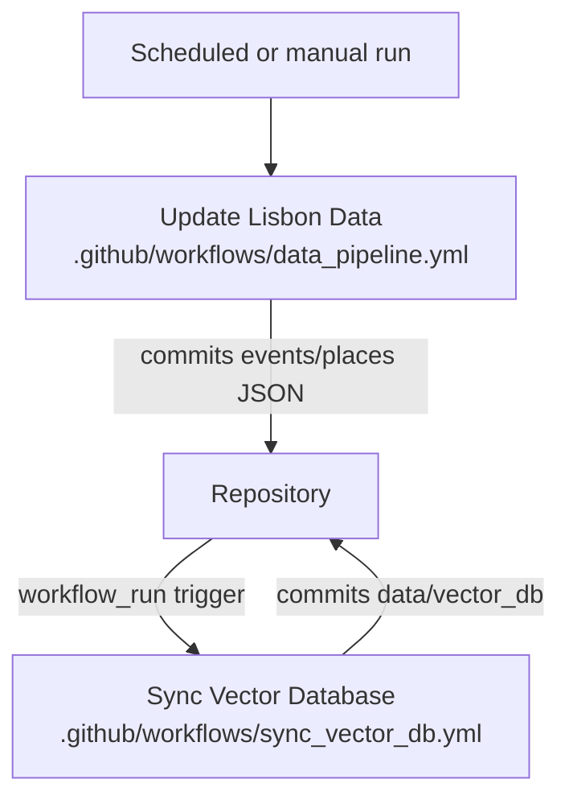

# Operations

This document describes environment configuration and automation.

## Run locally

Install dependencies:

```bash
pip install -r requirements.txt
```

Run the Streamlit UI:

```bash
streamlit run app_v1.py
```

Rebuild or test the vector store (optional):

```bash
python tools/vector_store.py --test
```

## Environment variables

Environment variables are loaded from a local `.env` file.

LLM providers:

- `OPENAI_API_KEY` (OpenAI)
- `OPENAI_MODEL_NAME` (optional)
- `AZURE_OPENAI_API_KEY` (Azure OpenAI)
- `AZURE_OPENAI_ENDPOINT` (Azure OpenAI)
- `AZURE_OPENAI_DEPLOYMENT_NAME` (optional, defaults to `gpt-5-nano`)

Notes:

- Multi-agent LLMs are configured in `config.py` under `AGENT_MODELS_*`.
- The Streamlit sidebar provider selection updates the active provider at runtime (used by the multi-agent system).
- LM Studio uses `Config.LMSTUDIO_BASE_URL` and `Config.LMSTUDIO_MODEL_NAME` from `config.py`.

Metro official API:

- `METRO_CONSUMER_KEY`
- `METRO_CONSUMER_SECRET`

Web knowledge:

- `TAVILY_API_KEY` (optional)

LangSmith tracing (optional):

- `LANGCHAIN_TRACING_V2` (set to `true` to enable)
- `LANGCHAIN_API_KEY`
- `LANGCHAIN_PROJECT` (optional)

## GitHub Actions

### 1. Update Lisbon Data

Workflow: `.github/workflows/data_pipeline.yml`

- Schedule: daily at 04:00 UTC
- Runs events scraper every day
- Runs places scraper on Mondays, or on manual trigger
- Commits `data_collection/webscraping/*.json` if changed

High level automation flow:



### 2. Sync Vector Database

Workflow: `.github/workflows/sync_vector_db.yml`

- Trigger: `workflow_run` after Update Lisbon Data completes successfully
- Uses CPU-only PyTorch
- Caches pip and HuggingFace model downloads
- Runs `python tools/vector_store.py --no-gpu --max-docs N` in a loop

Exit code protocol:

- `0`: complete
- `2`: more work pending
- `143`: SIGTERM (runner terminated process). The workflow treats this as a graceful stop and still commits partial progress.

Batch sizing rationale:

- `--max-docs` limits the number of documents processed per iteration to stay within CI time limits.
- If sync repeatedly times out, reduce `max_docs` (for example 100 to 150).

Monitoring tips:

- In GitHub Actions logs, look for per-iteration counts (added, updated, deleted) and whether the process exits with code `0` (done) or `2` (pending).
- If the workflow reaches its maximum iterations, rerun the workflow to continue processing remaining pending documents.

Expected runtime notes:

- Runtime depends on whether embeddings are computed and on runner performance.
- Places updates are typically the slowest because the collection is larger.

## Performance and latency

Implemented optimization areas (see `agent/utils/optimization.py`):

- Parallel agent execution
- Parallel tool execution within an agent step
- HTTP session pooling
- TTL caching (weather, transport, and static)
- Per-provider timeouts and retry limits

Defaults:

- HTTP timeouts use separate connect and read timeouts (connect is kept low to fail fast).
- TTL caches are tuned for common usage: weather is 5 minutes, transport is 60 seconds, static is 1 hour.

Concrete defaults (current implementation):

- HTTP session pool: `pool_connections=10`, `pool_maxsize=20`, `max_retries=2`.
- Parallel tool execution within agents: `max_workers=4` and a 30 second overall wait timeout.
- Azure OpenAI (v1 compatible): LLM client timeout is 60 seconds with `max_retries=2`.

## Troubleshooting

### ChromaDB Database Locked

**Symptom:**
```
sqlite3.OperationalError: database is locked
```

**Cause:** Multiple processes accessing `data/vector_db/chroma.sqlite3` simultaneously.

**Solution:**
1. Stop all Python processes accessing the vector store:
   ```bash
   # Windows
   taskkill /F /IM python.exe /FI "WINDOWTITLE eq *vector_store*"
   
   # Linux/macOS
   pkill -f "python.*vector_store"
   ```

2. Remove SQLite lock files:
   ```bash
   # Windows
   del data\vector_db\chroma.sqlite3-wal
   del data\vector_db\chroma.sqlite3-shm
   
   # Linux/macOS
   rm data/vector_db/chroma.sqlite3-wal
   rm data/vector_db/chroma.sqlite3-shm
   ```

3. Restart the sync process:
   ```bash
   python tools/vector_store.py
   ```

**Prevention:** Only run one vector store operation at a time.

### GitHub Actions Vector Sync Timeout

**Symptom:** Workflow exceeds 6-hour limit and terminates incomplete.

**Cause:** Large number of documents to process in a single run.

**Solution:**
1. Reduce batch size in `.github/workflows/sync_vector_db.yml`:
   ```yaml
   # Change from:
   --max-docs 200
   
   # To:
   --max-docs 100
   ```

2. Enable manual workflow dispatch to run multiple smaller batches:
   - Go to Actions → Sync Vector Database
   - Click "Run workflow"
   - Repeat until exit code is `0` (complete)

3. Monitor progress in workflow logs for iteration counts.

### Metro API Credentials Missing

**Symptom:** Metro tools return limited data or status only.

**Solution:** The system automatically falls back to the public endpoint (`https://app.metrolisboa.pt/status/getLinhas.php`). For full API access:
1. Register at https://api.metrolisboa.pt/store/
2. Add credentials to `.env`:
   ```
   METRO_CONSUMER_KEY=your_key
   METRO_CONSUMER_SECRET=your_secret
   ```

- If vector sync times out, reduce `max_docs`.
- If Metro credentials are missing, status falls back to the public endpoint.
