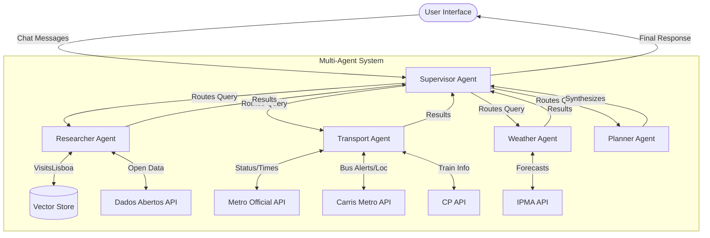

# System Architecture Diagrams

**Project**: Multi-Agent System for Urban Exploration  
**Author**: André Filipe Gomes Silvestre (Updated v2.1)  
**Last Updated**: January 28, 2026

---

## 1. High-Level System Architecture



### Component Roles

1.  **Supervisor Agent**: The orchestrator. Analyzes user intent and routes tasks to the appropriate specialized agent. It maintains the global conversation state.
2.  **Specialized Agents**:
    *   **Weather Agent**: Handles all meteorological queries using IPMA data.
    *   **Transport Agent**: manages real-time transport data (Metro, Bus, Train).
    *   **Researcher Agent**: Retrieves static knowledge (events, places) and open data.
    *   **Planner Agent**: Synthesizes information into coherent itineraries.
3.  **Tool Layer**: 40 specialized tools providing direct access to external APIs and databases.

---

## 2. Multi-Agent Workflow (LangGraph)

```
       ┌──────────────┐
       │     START    │
       └──────┬───────┘
              │
              ▼
    ┌────────────────────┐
    │  Supervisor Node   │◄─────────────────────────────┐
    │  (Router LLM)      │                              │
    └──────┬──────┬──────┘                              │
           │      │                                     │
   Weather │      │ Transport                           │
   Query   │      │ Query                               │
           ▼      ▼                                     │
   ┌─────────┐  ┌───────────┐                           │
   │ Weather │  │ Transport │    (Other Agents...)      │
   │  Agent  │  │   Agent   │                           │
   └────┬────┘  └─────┬─────┘                           │
        │             │                                 │
        ▼             ▼                                 │
   ┌─────────┐  ┌───────────┐                           │
   │  Tools  │  │   Tools   │                           │
   │  Node   │  │   Node    │                           │
   └────┬────┘  └─────┬─────┘                           │
        │             │                                 │
        └─────────────┴──────────► [Results] ───────────┘
```

---

## 3. Tool Execution Workflow (Example)

### Scenario: User asks about weather and bus delays

```
User: "Is it raining? And are there bus delays?"
    │
    ▼
┌─────────────────────────────────────────────────┐
│  Supervisor Reasoning                           │
│  "Complex query detected. Routing to:"          │
│  1. Weather Agent (for rain)                    │
│  2. Transport Agent (for bus delays)            │
└──────┬───────────────────────┬──────────────────┘
       │                       │
       ▼ (Parallel)            ▼
┌────────────────────┐   ┌──────────────────────────┐
│ Weather Agent      │   │ Transport Agent          │
│ Call:              │   │ Call:                    │
│ get_current_       │   │ get_carris_              │
│ weather_summary()  │   │ metropolitana_alerts()   │
└──────┬─────────────┘   └───────────┬──────────────┘
       │                             │
       ▼ IPMA API                    ▼ Carris API
┌────────────────────┐   ┌──────────────────────────┐
│ Result:            │   │ Result:                  │
│ "Light rain, 15°C" │   │ "Delays on line 728"     │
└──────┬─────────────┘   └───────────┬──────────────┘
       │                             │
       └──────────────┬──────────────┘
                      │
                      ▼
┌─────────────────────────────────────────────────┐
│  Supervisor Synthesis                           │
│  "It is currently raining (15°C). Additionally, │
│   be aware of delays on bus line 728."          │
└─────────────────────┬───────────────────────────┘
                      │
                      ▼
                 User Response
```

---

## 4. Vector Store Synchronization

```
GitHub Actions Trigger (Daily 2 AM UTC)
    │
    ▼
┌─────────────────────────────────────────────────┐
│  Web Scraping Jobs                              │
│  (VisitLisboa Events & Places)                  │
└──────────────────────┬──────────────────────────┘
                       │
                       ▼ JSON Files
┌─────────────────────────────────────────────────┐
│  Vector Store Sync (Incremental)                │
│                                                 │
│  Input: JSON Data                               │
│  Process:                                       │
│    1. Compute Content Hashes                    │
│    2. Compare with ChromaDB Metadata            │
│    3. Identify Add/Mod/Del                      │
│    4. Batch Update (200 docs/run)               │
└──────────────────────┬──────────────────────────┘
                       │
                       ▼
┌─────────────────────────────────────────────────┐
│  Commit & Push                                  │
│  (Updated ChromaDB files to repo)               │
└─────────────────────────────────────────────────┘
```

---

## 5. Data Sources Integration

```
┌──────────────────────────────────────────────────────────┐
│                    REAL-TIME APIs                        │
└──────────────────────────────────────────────────────────┘
    │           │            │            │
    ▼           ▼            ▼            ▼
┌────────┐ ┌─────────┐ ┌──────────┐ ┌─────────┐
│  IPMA  │ │  Metro  │ │  Carris  │ │   CP    │
│Weather │ │ Status  │ │Metro Bus │ │ Trains  │
└────────┘ └─────────┘ └──────────┘ └─────────┘
    │           │            │            │
    ▼           ▼            ▼            ▼
┌──────────────────────────────────────────────────────────┐
│                  TRANSPORT & WEATHER AGENTS              │
│  - get_weather_forecast()                                │
│  - get_metro_status()                                    │
│  - get_carris_metropolitana_alerts()                     │
│  - get_train_status()                                    │
└──────────────────────────────────────────────────────────┘


┌──────────────────────────────────────────────────────────┐
│             STATIC + SEMANTIC SEARCH                     │
└──────────────────────────────────────────────────────────┘
    │                    │                  │
    ▼                    ▼                  ▼
┌─────────┐      ┌──────────┐      ┌──────────┐
│ Events  │      │  Places  │      │   PDF    │
│  JSON   │      │   JSON   │      │  Guide   │
└─────────┘      └──────────┘      └──────────┘
    │                    │                  │
    └────────────────────┴──────────────────┘
                         │
                         ▼
               ┌─────────────────┐
               │   ChromaDB      │
               │  Vector Store   │
               └─────────────────┘
                         │
                         ▼
┌──────────────────────────────────────────────────────────┐
│                  RESEARCHER AGENT                        │
│  - search_cultural_events()                              │
│  - search_places_attractions()                           │
│  - search_lisbon_knowledge()                             │
└──────────────────────────────────────────────────────────┘
```

---

## 6. Deployment Architecture

```
┌────────────────────────────────────────────────┐
│          GitHub Repository                     │
│                                                │
│  - Source Code (Multi-Agent System)            │
│  - Data Files (JSON)                           │
│  - Vector DB (ChromaDB files)                  │
└───────────────┬────────────────────────────────┘
                │
                ▼
┌──────────────────────────────────────────┐
│    Streamlit Cloud / Local Runtime       │
│                                          │
│  1. Pulls latest code & DB               │
│  2. Initializes LangGraph Supervisor     │
│  3. Loads Vector Store into memory       │
│  4. Serves UI to User                    │
└──────────────────────────────────────────┘
```
